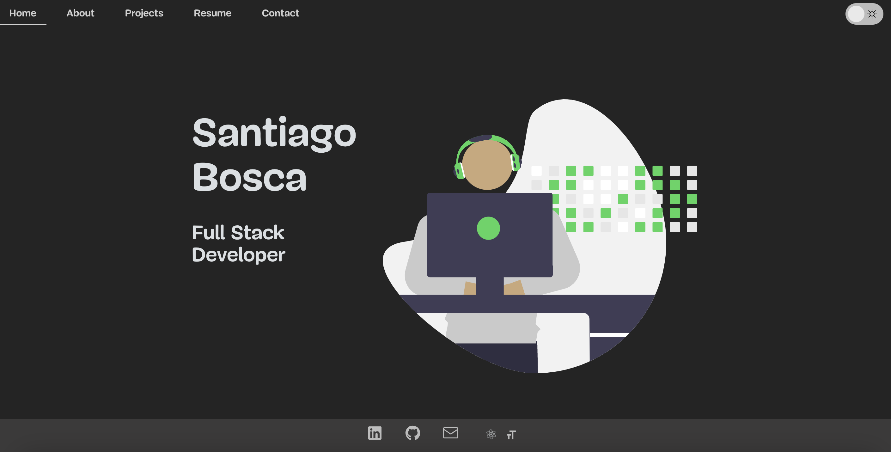
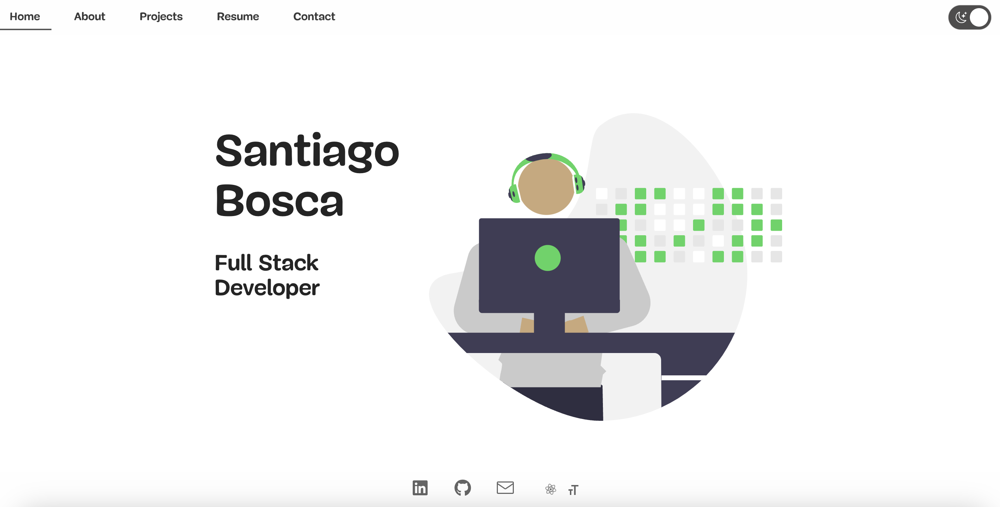

# Portfolio Site

  

  

  

  <a href="https://portfolio-4kyq3c4w9-borkoloco-gmailcom.vercel.app/" target="_blank">Live Site</a>
  

This portfolio is built using React and showcases my projects, skills, and experience as an app developer. It features several sections including a landing, about, projects, resume, and contact section.

The site is built using React functional components and hooks like useState and useEffect for managing state.

The landing displays a header with navigation links that smoothly scroll to the appropriate section. The fixed navbar allows easy navigation between sections.

The about section uses Flexbox's capabilities to layout the bio, skills, and summary sections neatly. The projects section utilizes react-alice-carousel to showcase projects in a responsive carousel slider.

The resume section displays a PDF of my resume and the contact form is implemented using emailjs.com to send messages directly to my email. Form data is managed with React state hooks.

Environment variables are loaded from .env files using dotenv. This allows configuration of API keys and other sensitive data.

React icons from react-icons library are used for clean SVG icons in the footer and elsewhere. React-scroll handles smooth scrolling on navigation click.

A custom ScrollToTop component displays a button to smoothly scroll back to the top. The footer contains social media links for LinkedIn, GitHub etc.

The site is deployed on Vercel with continuous deployment from GitHub. Performance is enhanced with lazy loading and caching techniques.

Overall, this responsive portfolio website showcases my projects and abilities as a React developer through clean design and smooth user experience. The use of React hooks, components, routing and libraries demonstrates modern best practices.

# React + Vite

This template provides a minimal setup to get React working in Vite with HMR and some ESLint rules.

Currently, two official plugins are available:

- [@vitejs/plugin-react](https://github.com/vitejs/vite-plugin-react/blob/main/packages/plugin-react/README.md) uses [Babel](https://babeljs.io/) for Fast Refresh
- [@vitejs/plugin-react-swc](https://github.com/vitejs/vite-plugin-react-swc) uses [SWC](https://swc.rs/) for Fast Refresh
